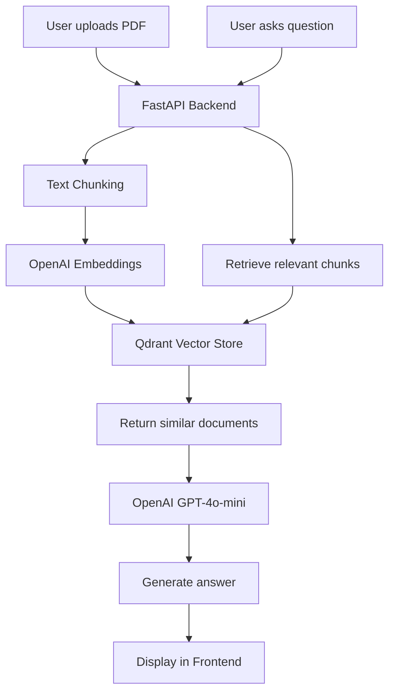

# 🧠 Warehouse RAG Chatbot

**LangChain + Qdrant + FastAPI + Vite Frontend (React)**

A complete end-to-end Retrieval-Augmented Generation (RAG) system that allows users to upload PDFs, index them in a Qdrant vector database, and ask natural-language questions about the content.

---

## 🚀 Tech Stack

| Layer | Technology |
|-------|-------------|
| **Frontend** | Vite + React |
| **Backend API** | FastAPI |
| **LLM & Embeddings** | OpenAI GPT-4o-mini + `text-embedding-3-large` |
| **Vector Database** | Qdrant |
| **Containerization** | Docker & Docker Compose |

---

## 📂 Project Structure
```
warehouse-chatbot/
│
├── backend/
│   ├── main.py              # FastAPI app (RAG pipeline)
│   ├── requirements.txt
│
├── frontend/
│   ├── src/                 # React frontend (Vite)
│   ├── package.json
│
├── docker-compose.yml       # Docker configuration for all services
├── .env                     
├── .gitignore              
└── README.md
```

---

## ⚙️ Environment Setup

Create a `.env` file in the root folder:
```bash
OPENAI_API_KEY=sk-xxxxxxxxxxxxxxxxxxxxxxxxxxxx
QDRANT_URL=http://qdrant:6333
```

---

## 🐳 Run with Docker

Build and start all containers:
```bash
docker-compose up --build
```

Then visit:

| Service | URL |
|---------|-----|
| **Frontend UI** | http://localhost:5173 |
| **FastAPI Backend** | http://localhost:8000 |
| **Qdrant Dashboard** | http://localhost:6333/dashboard |

---

## 💡 Features

✅ Upload PDF files (automatically chunked and embedded into Qdrant)  
✅ Ask natural-language questions about uploaded documents  
✅ Uses LangChain's latest modular stack (`langchain_core`, `langchain_openai`, `langchain_qdrant`)  


---

## 🔧 API Endpoints (FastAPI)

| Endpoint | Method | Description |
|----------|--------|-------------|
| `/upload` | POST | Upload and process a PDF |
| `/ask` | POST | Ask a question using RAG |
| `/health` | GET | Check service health |
| `/reset` | POST | Recreate the Qdrant collection |
| `/info` | GET | System & cache info |

---

## 🧰 Example Usage

### Ask Question Example
```bash
curl -X POST "http://localhost:8000/ask" \
     -H "Content-Type: application/json" \
     -d '{"query": "What safety guidelines are mentioned in the document?"}'
```

---

## 🧱 Docker Services Overview

| Service | Description |
|---------|-------------|
| **qdrant** | Vector database storing document embeddings |
| **backend** | FastAPI app handling PDF ingestion & RAG pipeline |
| **frontend** | Vite + React UI to upload files and chat with the system |

---

## 🧾 License

This project is released under the **MIT License**.

---

## 📊 System Architecture

